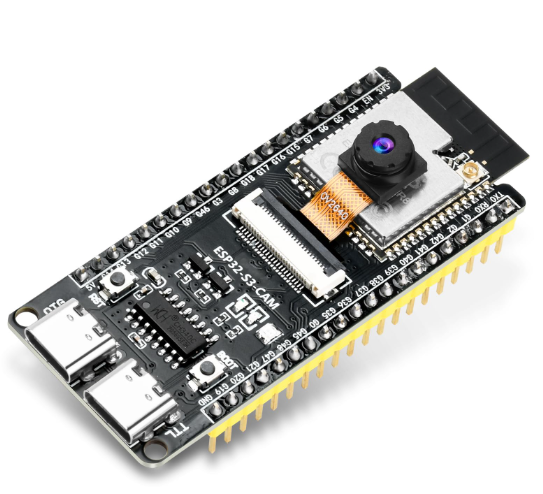
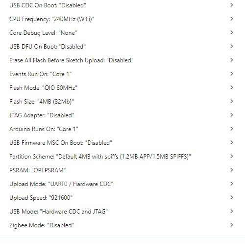

# TBTracker-ESP32

A Plug and Play High Altitude Balloon tracker for ESP32. Supports LoRa, LoRa-APRS, APRS, RTTY, Horus V1 4FSK, Horus V2 4FSK, Horus V3 4FSK and SSDV using esp32 camera's.

TBTracker-ESP32 is an Arduino sketch for a tracker for high altitude weather or scientific balloons. 
It supports sending telemetry data in mulitple formats:

- RTTY
- LoRa
- LoRa-APRS (with environmental data in the comment field)
- APRS (AFSK)
- Horus 4FSK V1
- Horus 4FSK V2
- Horus 4FSK V3
- SSDV (both lowres over LoRa and highres saved to SD card)

You can select multiple modes or just a single mode.

It is designed to send telemetry data in the correct format for https://amateur.sondehub.org.

If you transmit SSDV, and your transmission is received by the Sondehub community, your pictures will be visible at https://ssdv.habhub.org

The code is written in the Arduino IDE for ESP32 with a GPS module and a LoRa or FSK module like the sx1278 or sx1276 or Hope RFM9x.

# Library

You will need to install two extra Arduino library from the librairy manager:

- Radiolib
- TinyGPS++

The program also supports the BME280 environment sensor. If you enable that code, you will need to install the BME280 library by Tyler Glenn from the Arduino library manager.

# Hardware

The minimal hardware configuration you need is:

- ESP32 or ESP32S2 board
- GPS module (recommended Ublox Neo or ATGM336H)
- Lora module (sx1278, sx1276, sx1268, sx1262, RF69, LLCC68 (LLCC68 is not suitable for LoRa-APRS) or Hope RFM9x module)
- If you use SSDV: Freenove or compatible ESP32S3 with a camera interface

# Hardware example

Rob Goverde (PD7BOR) made a 2.5-gram ultralight tracker with only four parts. Best of all, he documented his project beautifully.
You can find his work here: https://www.robgoverde.nl/ct62-ballon-tracker-how-to/
It's written in Dutch, but if you don't speak the language, Google Translate should be a big help.

# Horusbinary_radiolib

The radio related basecode for this sketch was taken from the horusbinary_radiolib project.
See: https://github.com/projecthorus/horusbinary_radiolib

# Horusbinary V3

The Horus Binary v3 format is a protocol that is flexible enough to allow customization while still keeping a small overall size.
See: https://github.com/xssfox/horusbinaryv3

# Project Horus

Project Horus is a Amateur Radio High Altitude Ballooning project based in Adelaide, Australia
You can download your decoders from there.
See: https://github.com/projecthorus

# SSDV

As of Version 0.5.1 TBTracker supports SSDV. I used code for SSDV from Philip Heron. This is still very much experimental. We tested it using an ESP32-S3 N16R8 Devboard with 16MB Flash, 8MB PSRAM and a camera interface. I recommend the OV5640 camera's. 

With SSDV, a GPS, a sx1278, a SD card and a BME280 sensor, pin assignment becomes critical. Settings.h has a working example of the pins you can use with the ESP32-S3 N16R8.

Powering the ESP32S3 with a camera and SD card is difficult. The best way to power the whole thing is through the right USB connector. However, you can power the chip through the 5V pin. But then you need to supply the 5V pin with at least 6V. You might get away with 5V if you remove the power LED from the board.

The board I used:

I used these board settings:

# Installation

Connect your LoRa and GPS modules to your ESP board and change the values in the Settings.h file. See the comments in the Settings.h file. Compile in the Arduino IDE and upload to your board.

# APRS (AFSK)

At this moment APRS with AFSK only works on the "original" ESP32 series and not on the ESP32-Sx and ESP32-Cx versions. 

# Versions

V0.5.1

- Added support for SSDV over LoRa and saving to SD card

V0.4.1

- Added support for the RF69 module
- Repaired the RTTY mode for all modules
- Solved sevral small bugs
- Optimized some code

V0.4.0
New variables were defined in settings.h, so use the settings.h file that comes with this version

- Horus Binary V3 compatibility (including custom fields)
- Radiolib v7.5.0 compatibility
- Serial console output is now optional 
- Optimized some code 
- Disable Bluetooth if on the board
- Better setup information printed on startup

V0.3.3
New variables were defined in settings.h, so use the settings.h file that comes with this version

- Radiolib v7.4.0 compatibility
- Fixed some bugs with LoRa-APRS transmissions
- Added extra documentation in the settings.h file
- Added a GPS communication test at startup so you can check the correct setup of your GPS module
- Add optional extra fields in the LoRa-APRS comment string: Battery voltage, Temperature, Humidity, Air pressure

V0.3.2

- Radiolib backward version compatibility for Horus FSK4 in FSK4_MOD module. 
- Compatibility with SX1262
- Free text with LoRa APRS 
- Added module to print version and settings info

V0.3.0:
This is a major release, so expects some bugs

- Added assertions for the Radiolib calls. When a Radiolib call fails, the program will halt for 60secs. After that the esp32 will reboot.
- Added dual frequency for the Horus modes. So, if you want, the program can send Horus call on two different frequencies just like many of the RS41 balloons do.
- Added frequency offsets to all the modes. The current batches of LoRa modules do not have very accurate oscillators on board. You can now specify a frequency offset.
- Added a calibration mode. Just a simple function to determine the frequency error of your specific module
- Added support for SX126x and the cheap LLCC68 modules. Note that the LLCC68 modules cannot do LoRa APRS
- Added very basic support for APRS (besides the already existing LoRa-APRS). This function iscurrently not really stable. Some RF chips work correctly, some do not.
- Added basic option for geofencing. You can now specify specific LoRa-APRS frequencies for when your tracker is in a specific country.
- Added support for a voltage divider so voltage can be tracked better
- Added support for the BME280 sensor
- Improved programming comments

V0.1.1:  

- Added a temporary APRS device-ID (APZTBT)
- Added a timestamp to to the APRS packets for better compatibility with Sondehub

V0.1.0:

- Initial commit
